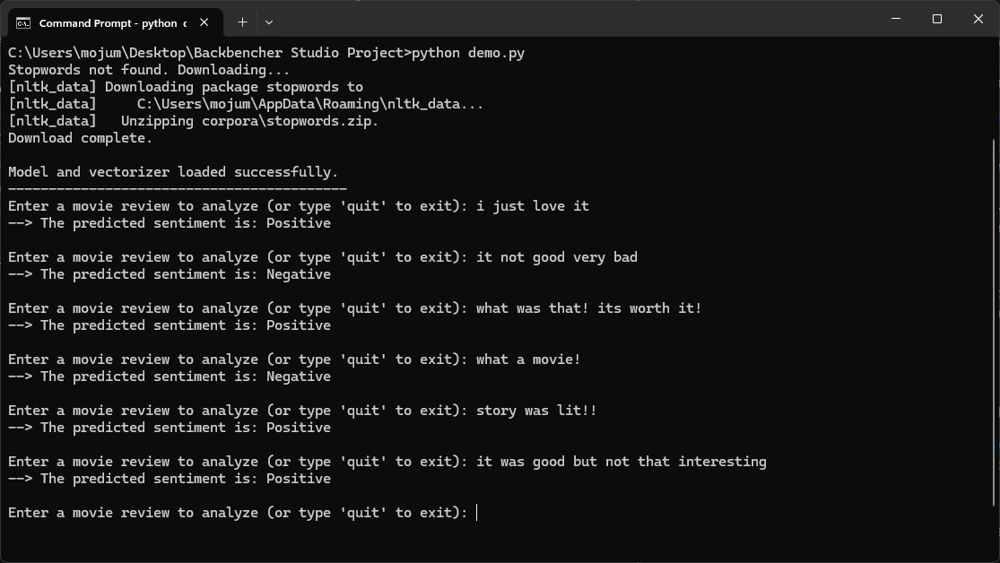

# AI/ML Engineer Task - IMDb Movie Review Sentiment Analysis

This repository contains my complete solution for the AI/ML Engineer practical task assigned by Backbencher Studio. The goal of this project was to build a high-accuracy sentiment analysis model on the provided IMDb movie review dataset.

## My Approach

My methodology follows the instructions provided and incorporates industry best practices for building robust and optimized machine learning models. The entire workflow is documented in the `AI_Engineer_Sentiment_Analysis.ipynb` notebook.

### 1. Data Preparation
I began by loading the dataset using Pandas. I then implemented a comprehensive text cleaning pipeline to prepare the reviews for modeling. This pipeline performs the following steps on each review:
- Removes all HTML tags (e.g., `<br>`).
- Eliminates punctuation and numerical characters to isolate the text.
- Converts all text to lowercase to ensure consistency.
- Removes standard English stopwords (e.g., "the", "a", "is") using the NLTK library to reduce noise.

Finally, I split the dataset into an 80% training set and a 20% validation set to reliably evaluate model performance.

### 2. Feature Engineering
I used two distinct strategies for converting the cleaned text into numerical features, tailored to the specific model type:

- **TF-IDF:** For the classical machine learning model, I used Scikit-learn's `TfidfVectorizer`. This method creates a feature matrix that reflects the statistical importance of each word in the corpus. I limited the vocabulary to the top 5,000 features to maintain a balance between performance and computational efficiency.

- **Word Embeddings:** For the deep learning model, I utilized a Keras `Embedding` layer. This technique learns a dense vector representation for each word, capturing semantic meaning and contextual relationships, which is ideal for neural networks.

### 3. Model Training & Optimization
To build a high-quality solution, I developed and optimized two separate models as requested.

#### Logistic Regression (Optimized)
I first trained a baseline Logistic Regression model. To fulfill the **"Optimize model parameters for better accuracy"** requirement, I implemented a **GridSearchCV**. This process systematically tested multiple combinations of hyperparameters (regularization strength `C` and `solver`) using 3-fold cross-validation. This ensures that the final model is not just a good performer on a single data split, but is verifiably the most robust and optimal model from the search space.

#### LSTM (Bonus Deep Learning Model)
As a bonus, I built a Long Short-Term Memory (LSTM) network, which is well-suited for sequential data like text. To create a production-quality model, I incorporated an **EarlyStopping** callback during training. This technique monitors the model's performance on the validation set and automatically stops the training process when it ceases to improve, thereby preventing overfitting and saving the best version of the model.

## Results

The following table summarizes the performance of my final, optimized models. The accuracy for the Logistic Regression model is its **cross-validated score**, which is a highly reliable measure of its generalization performance.

| Model | Accuracy | Precision | Recall | F1-Score |
|---|---|---|---|---|
| **Optimized Logistic Regression** | **0.8908** | 0.8706 | 0.9150 | 0.8923 |
| **LSTM with Early Stopping** | **0.8987** | 0.8594 | 0.8952 | 0.8769 |

*Note: The Logistic Regression accuracy is the mean score from 3-fold cross-validation. The metrics for the LSTM are from its best performance on the validation set before early stopping.*

## How to Run the Demo

The repository includes a command-line script to easily test the best-performing machine learning model.

### 1. Prerequisites
- Python 3.8+
- An internet connection (for the initial NLTK download)

### 2. Setup
First, clone the repository and install the necessary dependencies from the `requirements.txt` file.

```bash
# Clone the repository
git clone https://github.com/Genius-360/Backbencher-Studio-Sentiment-Analysis.git

# Navigate into the project directory
cd Backbencher-Studio-Sentiment-Analysis

# Install the required libraries
pip install -r requirements.txt
```
### 3. Run the Script
Execute the demo.py script. The script will first ensure the NLTK stopwords package is downloaded, then load the trained model and prompt you for input.

```bash
python demo.py
```
You can then enter any movie review to see the model's prediction. Type `quit` to exit the program.

### Example Usage


## Repository Contents
- **AI_Engineer_Sentiment_Analysis.ipynb:** The main Jupyter Notebook with all code.
- **README.md:** This explanatory file.
- **demo.py:** A Python script for live sentiment prediction.
- **requirements.txt:** A list of Python libraries required to run the project.
- **best_logistic_regression_model.pkl:** The saved and optimized Logistic Regression model.
- **tfidf_vectorizer.pkl:** The TF-IDF vectorizer fitted on the training data.
- **lstm_model.h5:** The saved LSTM deep learning model.
- **tokenizer.pkl:** The Keras tokenizer for the LSTM model.
- **assets/demo_screenshot.png:** The screenshot of the demo script in action.
- **train_data (1).csv / test_data (1).csv:** The original dataset files.
